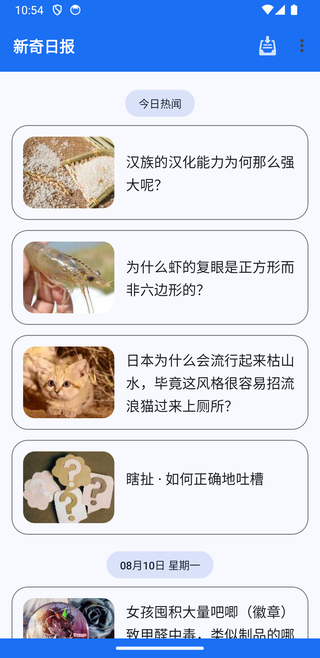
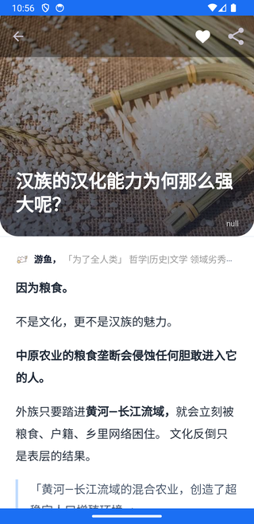
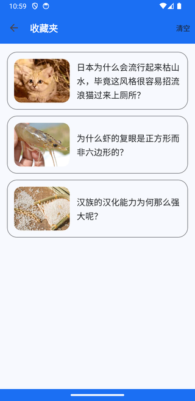
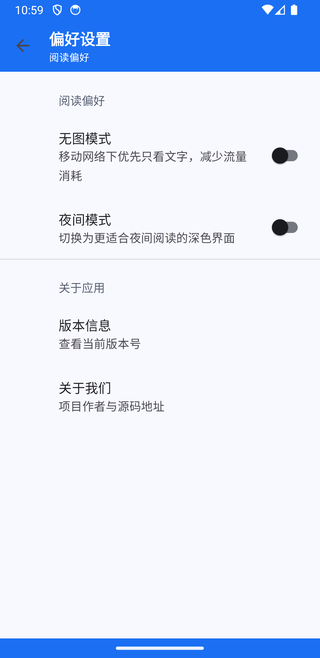

# 新奇日报 / ZhihuPaper

<p align="center">
  
</p>

<p align="center">
  一个轻量、无账号、无广告、以本地阅读为核心的知乎日报客户端。<br>
  A lightweight Android daily-news reader focused on private, local-first reading.
</p>

<p align="center">
  <a href="#中文">中文</a> · <a href="#english">English</a> · <a href="PRIVACY.md">隐私说明</a> · <a href="THIRD_PARTY_NOTICES.md">第三方许可</a>
</p>

> [!IMPORTANT]
> 本项目是独立的开源客户端，不是知乎官方产品，也不代表知乎。日报 API、文章、图片及相关商标由各自权利人控制，不包含在本项目的 Apache License 2.0 授权范围内。
>
> This is an independent open-source client. It is not an official Zhihu product and is not affiliated with Zhihu. The upstream API, articles, images, and trademarks remain the property of their respective owners and are not covered by this project's Apache License 2.0.

---

<a id="中文"></a>
## 中文

### 项目简介

新奇日报已完成 AndroidX、Material 3、现代网络与后台任务体系的迁移。在保持安装包轻量的同时，它不仅可以浏览最新和历史日报，也提供本地阅读库、离线缓存、阅读进度和连续阅读等能力。

应用不要求登录，不集成广告、统计或推送 SDK。收藏、稍后读、标签、短评、摘录和阅读状态均保存在设备本地，Android 自动备份已关闭。

### 核心能力

- **日报浏览**：查看最新日报和按日期加载历史内容。
- **安全阅读**：使用受约束的 WebView、本地 HTML 模板和 HTTPS 资源加载正文；禁止明文网络流量。
- **阅读库**：统一管理收藏、稍后读、标签、短评和正文摘录，并支持本地搜索和筛选。
- **阅读体验**：保存阅读位置，提供文章目录以及上一篇/下一篇连续阅读。
- **离线能力**：使用 WorkManager 调度离线同步；网络失败时回退到已有缓存，并限制正文图片缓存容量。
- **图片体验**：支持图片预览、缩放和保存到系统相册；图片下载会校验响应类型与实际内容。
- **个性化**：支持深色主题和移动网络无图模式。
- **分享与链接**：支持系统分享、存入印象笔记，以及 `http(s)://daily.zhihu.com/story/...` 和 `zhihudaily://story/...` 深链。

> `daily.zhihu.com` 由上游服务控制，本项目无法在该域名部署 `assetlinks.json`，因此这里只提供普通深链，不宣称 Android Verified App Links。

### 截图

| 首页 | 文章详情 | 阅读库 | 偏好设置 |
| --- | --- | --- | --- |
|  |  |  |  |

### 技术栈与工程设计

| 项目 | 当前配置 |
| --- | --- |
| 语言与运行环境 | Java 8，JDK 21（构建） |
| Android SDK | minSdk 21，compileSdk 36，targetSdk 36 |
| 构建工具 | Android Gradle Plugin 8.10.1，Gradle 8.11.1 |
| UI | AndroidX AppCompat、Material Components、Fragment、Preference、SwipeRefreshLayout |
| 网络与解析 | OkHttp 4.12.0、Gson 2.13.2、Jsoup 1.21.2 |
| 图片 | Glide 4.16.0 + OkHttp integration、内置 AndroidX PhotoView 模块 |
| 后台任务 | WorkManager 2.10.0 |
| 数据 | SQLite，本地数据库版本 9 |

关键设计：

- `:app` 是应用主体，`:photoview` 是迁移到 AndroidX 的内置图片缩放组件。
- Release 默认启用 R8 代码压缩、资源裁剪，并只打包中文应用资源。
- 网络层使用系统证书校验，不包含信任所有证书的降级逻辑。
- 正文在 WebView 中通过 `WebViewAssetLoader` 和本地模板展示，私有图片缓存映射到受控 HTTPS 地址。
- 离线同步由 WorkManager 管理约束和生命周期；可重新下载的数据与用户阅读库数据分开清理。
- 构建前会拒绝把压缩包、密钥、签名配置或 `local.properties` 打进 assets。

### 环境要求

- macOS、Linux 或 Windows
- JDK 21
- Android SDK Platform 36
- Android SDK Build-Tools（用于 Release 签名检查）
- 使用仓库内的 Gradle Wrapper，无需单独安装 Gradle

确保 `local.properties` 指向本机 Android SDK，例如：

```properties
sdk.dir=/path/to/Android/sdk
```

`local.properties` 是本机配置，已被 Git 忽略，不应提交。

构建 JDK 统一为 `.java-version` 中的 21；源码与字节码仍保持 Java 8 兼容。macOS 可设置 `export JAVA_HOME=$(/usr/libexec/java_home -v 21)`，Android Studio 的 Gradle JDK 也应选择 21。JDK 21 的 Java 8 目标过时警告暂保留，不代表构建失败。

### 构建 Debug

```bash
./gradlew --no-daemon :app:assembleDebug
```

Debug APK：

```text
app/build/outputs/apk/debug/app-debug.apk
```

安装到指定模拟器或设备：

```bash
adb -s <serial> install -r app/build/outputs/apk/debug/app-debug.apk
```

### 配置 Release 签名

复制模板并填写本机密钥信息：

```bash
cp keystore.properties.example keystore.properties
```

也可以通过环境变量 `ZHIHUPAPER_KEYSTORE_PROPERTIES` 指向仓库外的配置文件。配置中的相对 `storeFile` 路径以该配置文件所在目录为基准。真实密钥、口令、`keystore.properties`、APK 和 AAB 均已被忽略，禁止提交。

构建 Release：

```bash
./gradlew --no-daemon clean :app:assembleRelease
```

Release APK：

```text
app/build/outputs/apk/release/app-release.apk
```

### 测试与发布门禁

运行 JVM 单元测试：

```bash
./gradlew --no-daemon :app:testDebugUnitTest
```

启动模拟器或连接设备后运行 instrumentation 测试：

```bash
ANDROID_SERIAL=<serial> ./gradlew --no-daemon :app:connectedDebugAndroidTest
```

无需正式签名密钥的开发/CI 检查：

```bash
./scripts/verify-ci.sh
```

GitHub Actions 在 push 和 pull request 时运行同一入口：Debug 构建、JVM 测试、Debug/Release Lint，以及 instrumentation APK 编译；不自动发布，也不等于设备测试已执行。AI 与贡献者请先阅读 [AGENTS.md](AGENTS.md)。

完整本地 Release 门禁：

```bash
./scripts/verify-release.sh
```

该脚本会从干净目录构建 Release，运行 JVM 测试、App Lint 和 Debug 构建，并检查：

- Release APK 已生成；
- APK 不包含压缩包、密钥或本机配置；
- APK 未超过项目设定的 2.75 MiB 上限；
- `apksigner` 可以验证 APK 签名。

UI、网络、数据库或后台任务发生变化时，还应运行 instrumentation 测试，并在目标 Android 版本上手动回归启动、列表、详情、阅读库、连续阅读、离线和分享流程。

### 项目结构

```text
ZhihuPaper/
├── app/                         # 主应用、单元测试与 instrumentation 测试
│   └── src/main/
│       ├── assets/              # 正文模板、隐私与许可的应用内副本
│       ├── java/                # UI、网络、数据库、任务与工具代码
│       └── res/                 # 布局、主题、图标和字符串资源
├── photoview/                   # AndroidX PhotoView 图片缩放模块
├── screenshot/                  # README 产品截图
├── scripts/verify-release.sh    # 可复现的本地 Release 门禁
├── PRIVACY.md                   # 隐私与本地数据说明
└── THIRD_PARTY_NOTICES.md       # 第三方组件和内容声明
```

### 数据、隐私与许可

应用访问 `https://news-at.zhihu.com` 获取列表和正文，并按正文返回的 HTTPS 地址加载图片。上游接口的可用性、响应格式和内容不受本项目控制；断网或服务变化时，只能使用设备上已有的缓存。

当前代码声明网络和网络状态权限，并仅在 Android 9 及以下声明保存图片所需的存储写入权限（Android 6–9 在点击保存时申请），不包含账号、云同步、广告、推送、定位、通讯录、相机、麦克风或统计分析 SDK。详情见 [PRIVACY.md](PRIVACY.md)，第三方依赖及许可见 [THIRD_PARTY_NOTICES.md](THIRD_PARTY_NOTICES.md)。

### 已知边界

- 产品界面和应用资源目前仅提供中文。
- 无账号和云同步能力；卸载应用会删除本地阅读数据。
- 上游日报 API 并非本项目维护，可能在没有通知的情况下变更或停止服务。
- `daily.zhihu.com` 链接可被应用处理，但不是 Verified App Links。
- 自动离线任务受 Android 后台调度、网络约束和省电策略影响，不保证精确执行时间。

---

<a id="english"></a>
## English

### Overview

ZhihuPaper, branded in-app as **新奇日报**, is a lightweight Android daily-news reader. The current codebase has been migrated to AndroidX, Material Components, a modern networking stack, and lifecycle-aware background work while retaining its account-free and local-first design.

It does not include ads, analytics, or push SDKs. Favorites, read-later items, tags, notes, highlights, reading positions, and read state remain on the device. Android system backup is disabled.

### Features

- Browse the latest edition and load previous editions by date.
- Read sanitized article content in a constrained WebView backed by local templates and HTTPS resources.
- Organize favorites, read-later items, tags, notes, and text highlights in a searchable local library.
- Restore reading position, navigate a table of contents, and move continuously between adjacent stories.
- Schedule offline synchronization with WorkManager and fall back to available cached content when the network fails.
- Preview, zoom, and save images, with response-type and content validation before persistence.
- Switch between light and dark themes and reduce mobile-data usage with text-first mode.
- Share stories through Android, send them to Evernote, and handle supported story deep links.

The app handles regular `daily.zhihu.com` deep links. It cannot publish `assetlinks.json` on that upstream domain, so these links are **not** advertised as Android Verified App Links.

### Screenshots

| Home | Article | Library | Preferences |
| --- | --- | --- | --- |
|  |  |  |  |

### Technology and architecture

| Area | Current baseline |
| --- | --- |
| Language and build runtime | Java 8, JDK 21 |
| Android SDK | minSdk 21, compileSdk 36, targetSdk 36 |
| Build system | Android Gradle Plugin 8.10.1, Gradle 8.11.1 |
| UI | AndroidX AppCompat, Material Components, Fragment, Preference, SwipeRefreshLayout |
| Networking and parsing | OkHttp 4.12.0, Gson 2.13.2, Jsoup 1.21.2 |
| Images | Glide 4.16.0 with OkHttp integration, bundled AndroidX PhotoView module |
| Background work | WorkManager 2.10.0 |
| Persistence | SQLite, local database schema version 9 |

The `:app` module contains the product and tests; `:photoview` is the bundled AndroidX-compatible zoom component. Release builds enable R8 optimization and resource shrinking. Article HTML is rendered through a local template, and private cached images are exposed to WebView through a controlled HTTPS mapping. Offline scheduling is lifecycle-aware, while redownloadable caches and user-created library data have separate cleanup paths.

### Requirements and builds

Install JDK 21, Android SDK Platform 36, and Android Build-Tools, then use the checked-in Gradle Wrapper:

```bash
./gradlew --no-daemon :app:assembleDebug
```

The Debug APK is written to `app/build/outputs/apk/debug/app-debug.apk`.

For a signed Release, copy `keystore.properties.example` to the ignored `keystore.properties` file and provide local signing values, or set `ZHIHUPAPER_KEYSTORE_PROPERTIES` to a configuration file outside the repository. Never commit credentials or key material.

```bash
./gradlew --no-daemon clean :app:assembleRelease
```

The Release APK is written to `app/build/outputs/apk/release/app-release.apk`.

### Verification

Run local JVM tests:

```bash
./gradlew --no-daemon :app:testDebugUnitTest
```

Run instrumentation tests on a connected emulator or device:

```bash
ANDROID_SERIAL=<serial> ./gradlew --no-daemon :app:connectedDebugAndroidTest
```

Local development and GitHub Actions use `./scripts/verify-ci.sh` with JDK 21 pinned in `.java-version`. This builds Debug and instrumentation APKs, runs JVM tests and Debug/Release Lint without release credentials. Instrumentation APK compilation does not execute device tests. Java source/target remains 8; JDK 21 obsolete-target warnings are currently expected. See [AGENTS.md](AGENTS.md) for contribution rules.

Run the complete local Release gate:

```bash
./scripts/verify-release.sh
```

The gate performs a clean Release build, JVM tests, App Lint, and a Debug build. It also rejects sensitive files inside the APK, enforces the project's 2.75 MiB Release size ceiling, and verifies the APK signature with `apksigner`. UI, networking, database, or background-work changes should additionally receive instrumentation and manual runtime coverage.

### Data, privacy, and limitations

The app requests data from `https://news-at.zhihu.com` and loads article-provided images over HTTPS. This project does not control the upstream service, its availability, response format, or content. Existing on-device caches are the only fallback when the service is unavailable.

The app declares Internet and network-state permissions, plus storage-write permission limited to Android 9 and below for saving images (requested on demand on Android 6–9). It has no account system, cloud sync, ads, push notifications, location, contacts, camera, microphone, or analytics SDK. See [PRIVACY.md](PRIVACY.md) and [THIRD_PARTY_NOTICES.md](THIRD_PARTY_NOTICES.md) for details.

The UI and app-owned resources are currently Chinese-only. Uninstalling the app removes local reading data. Background sync timing depends on Android scheduling, network constraints, and battery policy.

## License

Copyright 2014–2026 Cundong

The source code is licensed under the [Apache License 2.0](LICENSE). Article content, Zhihu-related branding, and remotely loaded images are excluded from that license and remain the property of their respective owners.
